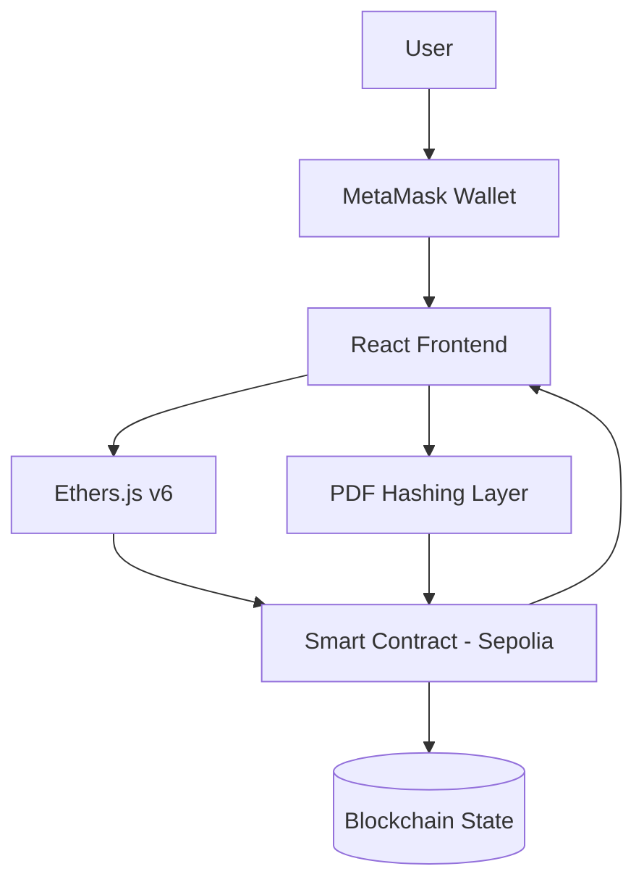
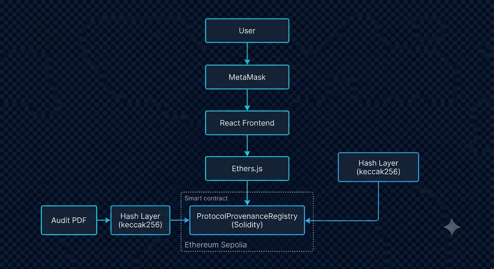
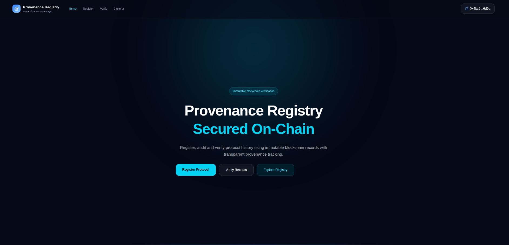
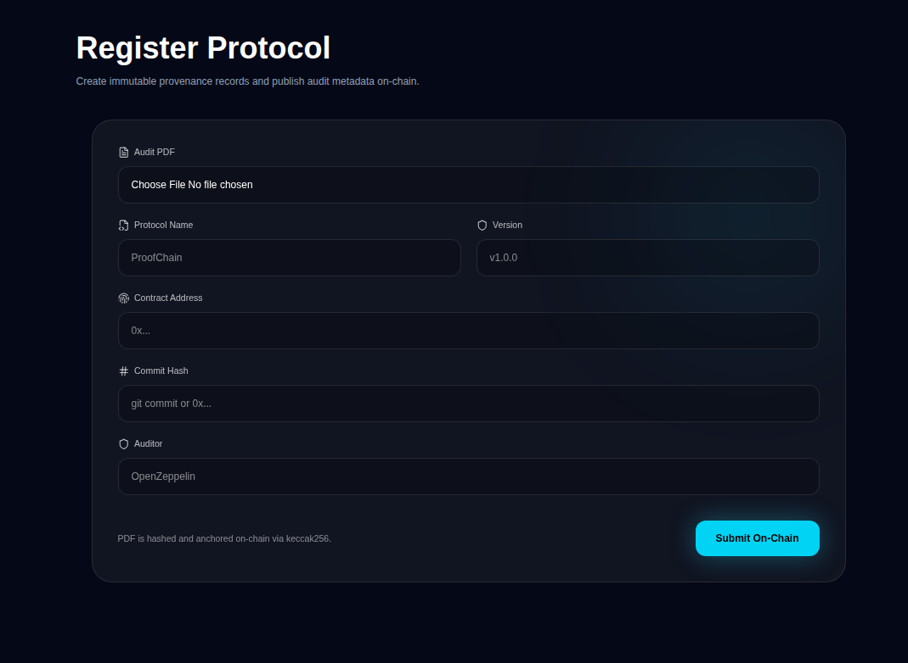
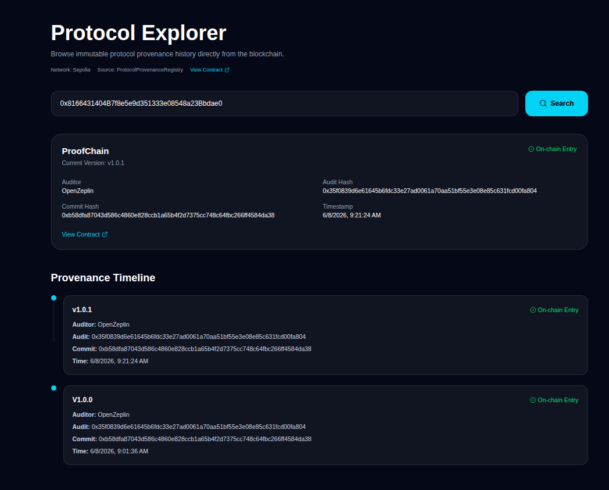
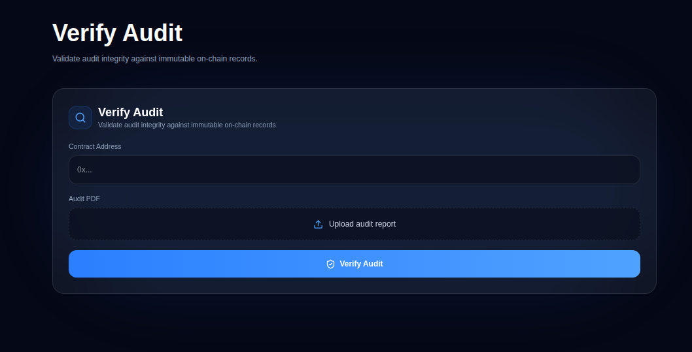
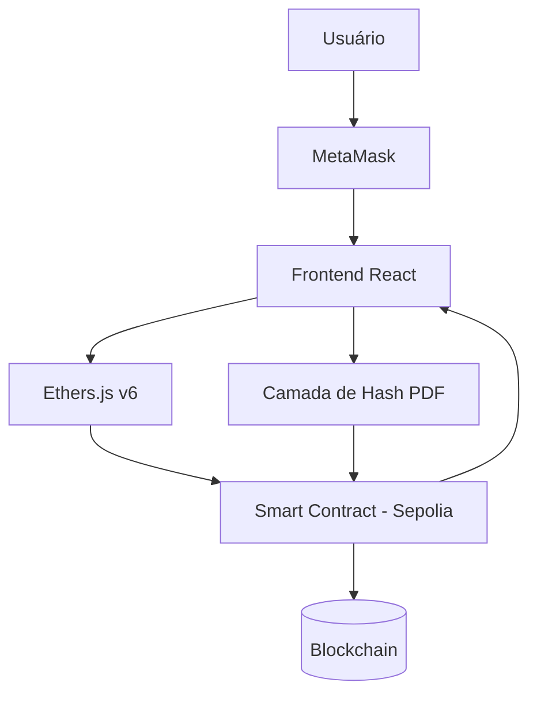

<div align="center">
  <br />
  <table width="100%" style="border-collapse: collapse; border-spacing: 0; background: linear-gradient(135deg, #0f172a 0%, #1e293b 100%); border-radius: 12px; overflow: hidden; border: 1px solid #334155;">
    <tr>
      <td align="center" style="padding: 50px 20px 40px 20px;">
        <!-- Cryptographic Node Logo Mark -->
        <svg xmlns="http://www.w3.org/2000/svg" viewBox="0 0 100 100" width="80" height="80">
          <polygon points="50,5 95,28 95,72 50,95 5,72 5,28" fill="none" stroke="#22D3EE" stroke-width="6" stroke-linejoin="round"/>
          <path d="M32,50 L45,62 L70,32" fill="none" stroke="#22D3EE" stroke-width="10" stroke-linecap="round" stroke-linejoin="round"/>
        </svg>
        <h1 style="color: #ffffff; font-family: -apple-system, sans-serif; font-size: 42px; font-weight: 800; margin: 15px 0 5px 0; letter-spacing: -1px;">
          Provenance<span style="color: #22D3EE; font-weight: 400;">Registry</span>
        </h1>
        <p style="color: #94a3b8; font-family: -apple-system, sans-serif; font-size: 16px; max-width: 500px; margin: 0 auto 25px auto; line-height: 1.5;">
          On-Chain Audit Provenance Layer. Making protocol evolution and audit integrity cryptographically verifiable on Ethereum.
        </p>
        <div>
          <div>
            <code style="background: #0f172a; color: #38bdf8; padding: 6px 12px; border-radius: 6px; border: 1px solid #1e293b; font-size: 13px;">
                Sepolia Contract:
                <a href="https://sepolia.etherscan.io/address/0x8166431404B7f8e5e9d351333e08548a23Bbdae0"
                style="color: #38bdf8; text-decoration: none;">
                0x8166...bdae0 ↗
                </a>
            </code>
        </div>
        </div>
      </td>
    </tr>
  </table>
  <br />
</div>

# 📌 Provenance Registry


---

## 🌐 Navigation / Navegação

- 🇺🇸 English Version → scroll to "# 🇺🇸 English Version"
- 🇧🇷 Versão Português → scroll to "# 🇧🇷 Versão Português"

---

# 🇺🇸 English Version

## 🚀 Provenance Registry — One-line Pitch

Provenance Registry is a **blockchain-based audit provenance system** that makes protocol evolution and audit integrity **cryptographically verifiable and publicly auditable on Ethereum**.

---

## 🚀 Problem

Web3 audit systems are fragmented:

- Off-chain audit storage
- No immutable link between audit and protocol evolution
- No verifiable provenance history
- Centralized trust assumptions

---

## 💡 Solution

Provenance Registry introduces a **fully on-chain provenance layer**:

- Immutable protocol registration
- Versioned audit tracking
- Cryptographic verification via hashing
- Public transparency via Ethereum

---

## 🧱 Architecture





---

## Application Screenshots

### Home



### Register Protocol



### Explorer



### Verify Audit



---

## ⚙️ Smart Contract

**ProtocolProvenanceRegistry.sol**

Core capabilities:

- Protocol registration
- Version tracking
- Auditor attribution
- Audit hash storage (keccak256)
- Commit hash tracking
- Timestamped records
- onlyOwner access control
- Event emission for indexing

Read functions:

- getProtocolHistory(address)
- getLatestRecord(address)
- getRecordCount(address)

---

## 🌍 Live Deployment

- Network: Ethereum Sepolia
- Contract Address:

```
0x8166431404B7f8e5e9d351333e08548a23Bbdae0
```

- Fully verifiable on Etherscan / Blockscout
- Real gas-based execution enabled

---

## 🌐 Frontend

Stack:
React + TypeScript + Vite + TailwindCSS + Framer Motion + Ethers v6

Pages:

- Home
- Register
- Explorer
- Verify

---

## 🔗 Web3 Layer

Modules:

- contract.ts → Contract abstraction
- web3.ts → Provider + signer
- WalletProvider.tsx → Wallet state
- hashPdf.ts → Cryptographic hashing
- checkNetwork.ts → Network validation

Flow:
MetaMask → Sign → Transaction → Smart Contract → Blockchain → UI Update

---

## 🧾 Core Flows

### Register

User → Wallet → Metadata → Blockchain Storage

### Explorer

User → Smart Contract → History → Timeline UI

### Verify

PDF → Hash → On-chain Comparison → VALID / INVALID


---

## 🔐 Security Model

- onlyOwner write restriction
- Hash-based integrity verification
- No file storage on-chain
- Fully transparent blockchain state

---

## 🧠 Trust Model

- Blockchain = Source of Truth
- Hashing = Integrity Layer
- Wallet = Identity Layer
- Smart Contract = Execution Layer

---

## 🏁 Status

Smart Contract: Complete  
Frontend: Complete  
Web3 Integration: Complete  
Testing: Complete  
Sepolia Deployment: Complete  
Verify System: Complete

---

## 🎬 Demo Flow (Judge Walkthrough)

1. Connect MetaMask wallet
2. Register protocol on-chain
3. View transaction on Sepolia explorer
4. Navigate Explorer page
5. Upload audit PDF
6. Verify hash integrity (VALID / INVALID)

---

## 🚀 Impact

- Removes trust dependency in audits
- Enables verifiable protocol evolution
- Provides public audit transparency layer
- Establishes blockchain-native audit history

---

## 👥 Team

Tomás Patrício da Silva Araújo

---

## 📄 License

MIT

---

# 🇧🇷 Versão Português

## 🚀 Provenance Registry — Pitch em uma frase

Provenance Registry é um sistema de **proveniência de auditoria baseado em blockchain** que torna a evolução de protocolos e auditorias **verificável criptograficamente e publicamente auditável na Ethereum**.

---

## 🚀 Problema

Sistemas de auditoria em Web3 são fragmentados:

- Armazenamento off-chain
- Sem ligação imutável entre auditoria e evolução do protocolo
- Histórico não verificável
- Confiança centralizada

---

## 💡 Solução

O Provenance Registry introduz uma **camada de proveniência totalmente on-chain**:

- Registro imutável de protocolos
- Rastreamento versionado de auditorias
- Verificação criptográfica via hashing
- Transparência pública via Ethereum

---

## 🧱 Arquitetura




---

## 📸 Capturas da Aplicação

### Home


### Register Protocol


### Protocol Explorer


### Verify Audit


---

## ⚙️ Smart Contract

**ProtocolProvenanceRegistry.sol**

Funcionalidades:

- Registro de protocolos
- Controle de versões
- Atribuição de auditor
- Hash de auditoria (keccak256)
- Hash de commit
- Timestamp
- Controle onlyOwner
- Eventos on-chain

Funções de leitura:

- getProtocolHistory(address)
- getLatestRecord(address)
- getRecordCount(address)

---

## 🌍 Deploy

- Rede: Ethereum Sepolia
- Contrato:

```
0x8166431404B7f8e5e9d351333e08548a23Bbdae0
```

- Verificável em exploradores públicos
- Execução real com gas

---

## 🌐 Frontend

Stack:
React + TypeScript + Vite + TailwindCSS + Framer Motion + Ethers v6

Páginas:

- Home
- Register
- Explorer
- Verify

---

## 🔗 Web3 Layer

Módulos:

- contract.ts → abstração de contrato
- web3.ts → provider + signer
- WalletProvider → estado da carteira
- hashPdf.ts → hashing
- checkNetwork.ts → validação de rede

Fluxo:
MetaMask → Assinatura → Transação → Smart Contract → Blockchain → UI

---

## 🧾 Fluxos

Registro:
Usuário → Carteira → Dados → Blockchain

Explorer:
Usuário → Smart Contract → Histórico → Timeline

Verificação:
PDF → Hash → Comparação → VALID / INVALID


---

## 🔐 Segurança

- onlyOwner para escrita
- Verificação por hash
- Sem armazenamento de arquivos sensíveis
- Estado público e auditável

---

## 🧠 Modelo de Confiança

- Blockchain = Verdade
- Hash = Integridade
- Carteira = Identidade
- Smart Contract = Execução

---

## 🏁 Status

Completo em todas as camadas

---

## 🎬 Demonstração

1. Conectar MetaMask
2. Registrar protocolo
3. Ver transação no explorer
4. Abrir Explorer
5. Enviar PDF
6. Verificar integridade

---

## 🚀 Impacto

- Remove dependência de confiança centralizada
- Torna auditorias verificáveis
- Cria histórico público de protocolos
- Estabelece camada de auditoria on-chain

---

## 👥 Time

Tomás Patrício da Silva Araújo

---

## 📄 Licença

MIT
